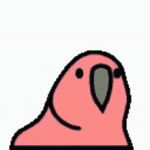

```
 _____       _ _        _           _ _ 
/  ___|     (_) |      | |         | | |
\ `--. _ __  _| | _____| |__   __ _| | |
 `--. \ '_ \| | |/ / _ \ '_ \ / _` | | |
/\__/ / |_) | |   <  __/ |_) | (_| | | |
\____/| .__/|_|_|\_\___|_.__/ \__,_|_|_|
      | |                               
      |_|    
```                           
We're modeling spikeball games with 4 players and 2 teams, where each team has 2 players. The players in each team and the position of the players are static. The game ends when either team has won by receiving 2 points.

We want to explore the different Spikeball games Forge generates given the constraints and the number
of states.

Below is a visual of the Spikeball court and the positions of the players.
* P1 is the server for Team 1 and North
* P2 is West
* P3 is East
* P4 is the server for Team 2 and South

```
       P1 
       --
 P2   |  |   P3
       --      
       P4
```

# Model Design Choices 
Give an overview of your model design choices, what checks or run statements you wrote, and what we should expect to see from an instance produced by the Sterling visualizer. How should we look at and interpret an instance created by your spec? Did you create a custom visualization, or did you use the default?

As an overview, our model contains `sigs` for each of the positions, teams, players, and the state of the game. We use abstract `sigs` for teams, positions, and players as teams and players share similar fields (detailed below). The fields of these `sigs` define that each team has a designate server, and each player has a position and a team. The state of the game is represented by the `SBState` `sig` and contains information about the current state in its fields, such as the score, the serving team, and most importantly, *the ball's position*.

The fields in the state `sig` allow for most of the logic that drives the game:
* `possession`: possession allows us to award points to the correct team
* `is_serving`: is_serving allows us to enforce the behavior of the server after a point is awarded
* `serving_team`: serving_team allows us to track which team is serving
* `num_touches`: num_touches allows us to enforce the maximum number of touches in a rally
* `server`: server allows us to keep track of who is the server on a given team at each state and switch servers at certain points of the game

We spent a lot of time playing around with the different constraints and rules we wanted to enforce. When we attempted to model the nitty-gritty nuances of the game, our traces became very long and difficult to interpret. Therefore, we enforces the following abstractions to ensure easier interpretation of the traces yet still retain the essence of the game:
* To contrain the number of traces, we enforced that the maximum number of touches in a rally is 3, and the team to get to 2 points first wins the game.
* The winning team will always continue serving until the opposing team wins a point. **(true to the real game!)**
* Players do not swap cardinal positions.
* On serve, there is no designated receiver, any player on the opposing team can hit the ball to start a rally.

When interpreting the Sterling output, the most important part is seeing how the `ball` field changes, to see how rallies, serving, and hitting to the net operate. You should see serves to either the net or the ground. In the case that it hits the net, it would either result in hitting the ground or the start of a perfect 3-touch rally. Due to using the maximum of 3 touches each time, the points are always awarded when the ball transitions from the net to the ground. You will also see that, in each state, each team has their own score.

To make the long traces easier to interpret, we created a ✨custom visualizer in Javascript!


# High-level description of Sigs and Preds
Sigs:
- {Position} (abstract); represents the possible positions the ball and the players could take
      - Net (extends Position)
      - Ground (extends Position)
      - North (extends Position)
      - South (extends Position)
      - East (extends Position)
      - West (extends Position)
- {Team} (abstract); represents the teams in the game; each team has a designated server
      - Team1 (extends Team)
      - Team2 (extends Team)
- {Player} (abstract); represents the players in the game; each player has a team and a position
      - P1 (extends Team)
      - P2 (extends Team)
      - P3 (extends Team)
      - P4 (extends Team)
      - **Fields**: `team: one Team,
                  position: one Position`
- {SBState}; represents a state in the game and contains information about the current state in its fields,
such as the score, the serving team, and the ball's position.
      - **Fields**: 
                  `next: lone SBState,
                  score: pfunc Team -> Int,
                  num_touches: one Int,
                  ball: one Position,
                  possession: one Team,
                  serving_team: one Team,
                  server: pfunc Team -> Player,
                  is_serving: one Int`

Preds:
- {SBinitState}
- {SBValidStates}
- {SBfinalState}
- {SBvalidTransition}
- {validServeTransition}
- {invalidServeTransition}
- {SBnetTransition}
- {SBgroundTransition}
- {SBrallyTransition}
- {SBrallyToGroundTransition}
- {SBrallyToNet}
- {SBfoulTransition}
- {TransitionStates}
- {SBSetup}
- {traces}

{traces} captures the entire game by calling {SBValidStates}, {TransitionStates}, and {SBSetup}.

{SBinitState}, {SBfinalState}, {SBvalidTransition} together construct the 3 main stages of the game: the start, the transitions between states in the middle, and the final state.

Since there are several possible transition cases between states, we broke {SBvalidTransition} down to
the following transition predicates: {validServeTransition}, {invalidServeTransition}, {SBnetTransition}, {SBgroundTransition}, {SBrallyTransition}, {SBrallyToGroundTransition}, {SBrallyToNet}, {SBfoulTransition}. 

{SBValidStates} specifies the constraints that need to hold for a state to be valid and ensures that all states in the game are valid.

{TransitionStates} calls {SBinitState}, {SBfinalState} and {SBvalidTransition} to bring the different stages together and construct a full game.

{SBSetup} contains the static values in the game, including the positions of the players and the players on each team.

# New Features (compared to Curiosity Modeling)
We added the following new features to our model to make it a more accurate representation of real life Spikeball games:
- When a team is serving, the ball can either hit the net or the ground (In Curiosity Modeling, the ball could only hit the net).
- Rallies can take either 1, 2 or 3 touches (In Curiosity Modeling, the rallies always used up all 3 touches).
- The server on a team switches to the other player when the team started a serve but lost the point (In Curiosity Modeling, the servers on the teams were static throughout the game).
- Custom visualizer!! (We used the default visualization in Curiosity Modeling)

# Omitted Features
* Cannot move 360 degrees after serve
* No infractions (when a player blocks another player from getting the ball)


<p style="font-size: 0.5em">Thanks for reviewing!</p>

